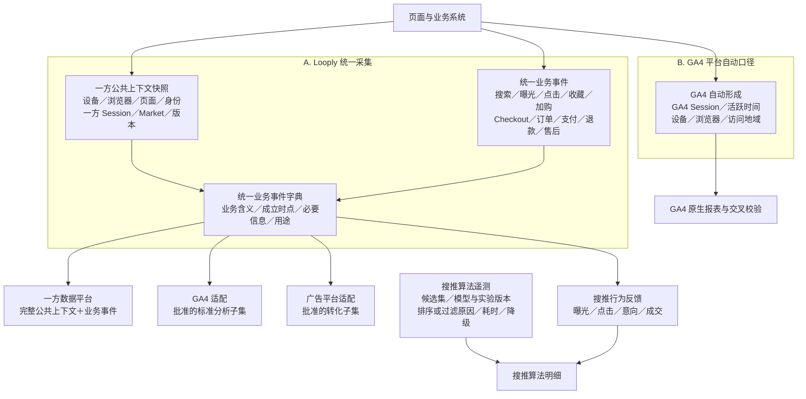

# Looply 数据采集与埋点产品需求

> 版本：v1.0  
> 日期：2026-08-13  
> 状态：已冻结，可交付开发  
> 适用范围：PC、Mobile 和 Tablet Web；App 不在本期范围  
> 文档定位：本文件是数据采集与埋点的唯一产品需求工作稿，统一回答采集什么、何时成立、在哪里触发、进入哪些平台及存量埋点如何处理。技术实现由开发方案确定。

## 一、背景、目标与范围

### 1.1 背景

Looply 已存在 GA4 自动采集、Snowplow 存量事件，以及广告、搜推和数据报表各自需要的数据。已有建设服务于不同目标，但缺少一套统一的产品口径，容易出现同一行为被重复记录、同一业务事实使用不同名称或时点、商品与订单无法稳定关联，以及不适合的数据被发送至外部分析平台。

本方案从产品经理视角建立统一要求。产品负责定义业务事实和验收结果，开发团队据此选择实现方式并形成技术方案。

### 1.2 目标

1. 覆盖网站中所有具有明确产品意义的用户操作，并能关联订单、支付、退款等权威业务结果；售后、履约和库存等已有业务表事实直接读取，不重复创建埋点事件。
2. 让一个需要跨平台使用的业务事实只有一个权威表达，再按批准范围供一方分析、GA4、广告和搜推使用。
3. 建立可解释的身份、Session、来源、商品、订单和触点关联，支持经营分析、用户旅程、归因和搜推迭代。
4. 保证事件不重复、不漏关键业务信息，不绕过业务模块采集输入原文，也不将敏感数据发送至不适合的平台。

### 1.3 当前范围

- PC、Mobile、Tablet Web 的页面访问和有意义交互。
- 搜索、推荐、商品浏览与意向、购物车、Checkout、订单、支付、退款、售后和归因链路。
- 一方公共业务信息、身份与一方 Session 口径。
- 一方分析、GA4、广告和搜推的数据使用边界。
- 存量事件的产品处理原则与产品验收标准。

本期仅覆盖 PC、Mobile 和 Tablet Web。App 不在本期范围；当前统一业务事件、公共业务信息和业务标识需支持未来 App 复用。待 App 产品方案确定后，另行补充 App 页面及有意义用户操作的采集需求。

### 1.4 产品与开发职责边界

| 产品经理负责 | 由开发／数据／测试方案落实 |
|---|---|
| 业务目标、业务事实、成立时点和统计口径 | SDK、接口、服务、代码位置和调用方式 |
| 公共业务信息和事件专属业务信息 | 字段技术类型、Schema、表结构和存储引擎 |
| 身份、Session、来源、归因和隐私产品规则 | 发送、队列、重试、技术幂等和故障恢复 |
| 各平台可使用的数据范围和禁止重复原则 | GTM、Nacos、Snowplow及各平台具体配置 |
| 同一业务事实只计一次的结果要求 | 部署、回滚、日志、监控和运行报告 |
| 产品验收场景和预期结果 | 自动化脚本、技术对账工具和执行方式 |

技术方案可以选择不同实现，只要最终满足本方案的产品规则和验收标准。

## 二、产品数据架构与平台分工

### 2.1 统一数据架构

图中包含两类数据来源：

1. **Looply 统一采集**：记录一方公共上下文和统一业务事件，供一方分析使用，并按批准范围适配至 GA4、广告和搜推。
2. **GA4 平台自动口径**：由 GA4 自行形成 Session、活跃时间、设备、浏览器和访问地域等数据，用于 GA4 原生分析及交叉校验。

Looply 自身分析所需的页面、设备、浏览器、身份、一方 Session、Market 和业务事件直接保存在一方数据中，不依赖先发送给 GA4 再回取。GA4 平台口径不替代 Looply 的一方公共上下文和统一业务事件。

### 2.2 统一治理原则

1. **一个业务事实只形成一次统一事件。** 多个平台可以消费同一事件，但不能各自重新定义或重复产生同义事实。
2. **成功事实按真实结果记录。** 点击只表示意图；收藏、加购、Checkout、订单、支付和退款等成功事件必须以对应业务状态真实成立为准。
3. **GA4 自动采集与主动适配互斥。** 同一个 GA4 业务事实只能选择自动采集、主动适配或不发送其中一种方式。
4. **业务事件优先于通用交互。** 已有明确业务事件时不再为同一次操作重复记录通用交互事件。
5. **原始事实与派生结果分离。** 原始来源、触点、事件和交易事实不被渠道分类、归因或标准化结果覆盖；派生结果带规则版本，可重算。
6. **算法遥测与用户行为分离。** 商品曝光、点击、收藏、加购和成交属于统一用户行为；候选集、分数、模型、实验、排序、过滤和耗时属于搜推专项遥测。

### 2.3 有意义交互的产品定义

以下操作属于“有意义交互”：

- 导航到页面或模块；
- 改变用户可见状态或选择；
- 表达搜索、找货、商品或交易意图；
- 进入关键业务漏斗；
- 触发需要分析的失败或用户主动重试；
- 用于判断功能使用率或定位用户体验问题。

指针移动、按下／抬起、触摸轨迹、普通 hover、焦点变化、文本选择、DOM 冒泡、组件渲染和无业务含义的滚动过程不属于普通行为事件。逐页面覆盖明细见本文件第六章。

页面到达、搜索结果和主动重试分别使用第五章定义的`page_view`、`view_search_results`和`ui_interaction`；其他普通加载异常进入技术监控。

## 三、公共业务信息

### 3.1 统一事件的基础识别信息

每个统一事件必须包含以下基础字段。字段技术类型、生成位置和传递方式由技术方案确定，但字段业务含义不得改变。

| 字段名 | 必填 | 产品含义与要求 |
|---|---|---|
| `event_id` | 是 | 同一次业务事实的唯一标识；重试继续使用同一值，不能形成第二次统计 |
| `event_name` | 是 | 只能取第五章列出的22个统一事件名 |
| `occurred_at` | 是 | 事实真实发生时间，不用发送或处理时间替代 |
| `event_version` | 是 | 当前事件定义版本，用于解释后续口径变化 |
| `producer_type` | 是 | `client`或`business_system`；区分客户端行为与业务结果事实 |

每条逻辑业务事实分别拥有自己的`event_id`。商品曝光按每件商品形成逻辑事实，因此每件曝光分别拥有`event_id`和`exposure_id`；技术批量传输时，这两个标识随对应`items[]`元素保留，批量外层不替代商品级事实标识。

### 3.2 客户端行为的公共上下文

对客户端产生的用户行为，应按适用场景记录身份、Session、页面、设备、Market、模块及来源等公共上下文，以便分析行为发生的环境与入口。具体参数格式和附加方式由技术方案确定。

| 信息组 | 字段名 | 必填规则 | 使用要求 |
|---|---|---|---|
| 身份 | `anonymous_id`、`user_id`、`identity_state` | `anonymous_id`为客户端事件必填；其余有值时必填 | 登录后客户端事件同时保留当时两类 ID；未知保持未知 |
| 一方 Session | `session_id` | 客户端事件必填 | 关联事件发生时所属Session；不与GA4 Session混用 |
| 页面 | `page_type`、`page_id`、`page_version`、`page_instance_id`、`page_url_clean`、`previous_page_type` | 前五项为客户端事件必填；上一页面有值时必填 | `page_instance_id`标识一次真实页面实例：首次打开、有效路由切换和刷新产生新值；组件重渲染和同一路由重复回调沿用原值。不用页面标题、显示文案或DOM结构充当稳定标识 |
| 设备与环境 | `platform`、`device_category`、`browser_name`、`os_name`、`client_version` | 客户端事件必填 | `platform=web`；设备类别为`pc`、`mobile`、`tablet`、`unknown` |
| 市场与地域 | `market`、`country`、`region`、`city` | `market`必填；地域合法取得且有值时填写 | 当前`market=US`；地域缺失不猜测 |
| 模块与入口 | `module_id`、`placement_id`、`config_id`、`entry_context`、`module_version` | 行为发生在具体模块或入口时，`module_id`、`entry_context`和`module_version`必填；`placement_id`在商品曝光场景必填；`config_id`仅在实际存在运营或配置对象时必填 | `module_id`标识业务模块，`placement_id`标识页面内稳定展示位；改显示名称不改变稳定ID，已停用ID不复用 |
| 来源与触点 | `landing_page_clean`、`referrer_clean`、`utm_source`、`utm_medium`、`utm_campaign`、`utm_content`、`utm_term`、`click_id`、`touchpoint_at` | 首次合法取得或发生变化时填写 | 原始合法触点不被渠道分类覆盖 |

`page_type`表示页面业务类别，`page_id`表示具体稳定页面。当前映射如下；新增正式页面时，产品在上线前补充，开发不得使用页面标题临时替代：

| `page_type` | `page_id` |
|---|---|
| `home` | `home` |
| `listing` | `shop`、`collection`、`search_results`、`favorites`、`wishlist`、`recently_viewed` |
| `product` | `product_detail` |
| `cart` | `cart` |
| `checkout` | `checkout` |
| `auth` | `login`、`sign_up` |
| `account` | `account`、`profile`、`addresses` |
| `order` | `orders`、`order_detail` |
| `returns` | `returns` |
| `content` | `privacy_policy`、`your_privacy_choices`、`terms_of_service`、`accessibility`、`shipping_returns`、`contact`、`help`、`about` |

`ui_interaction`统一使用：`interaction_name`、`element_id`、`target_id`、`action`、`result_state`。`result_state`只取`success`、`failed`、`cancelled`、`blocked`；不得把显示文案或自由错误文本作为字段值。第六章同一行列出的多个动作必须使用不同的稳定`action`值，不能共用一个模糊动作名。

`page_id`表示事件实际发生的页面；`source_page_id`仅表示引导该业务事实发生的来源页面。两者相同时不重复填写`source_page_id`；来源链路同时使用`source_type`、`source_module_id`和`source_event_id`保存可用的原始站内来源。

### 3.3 业务对象标识

业务事件需要携带其所关联对象的稳定标识，以便串联同一商品、搜索、购物车、订单及订单商品行。具体字段类型和传递方式由技术方案确定。

| 对象 | 业务对象标识 | 产品规则 |
|---|---|---|
| 单商品行为 | `product_id`、`listing_id`、`listing_public_code` | 三者来自同一商品和上架关系；缺失时不进入正式商品统计 |
| 多商品行为 | 每个商品分别携带以上三个 ID | 不能用一个顶层商品 ID 代表多个商品 |
| 订单商品行 | `order_item_id` 加上述三个商品 ID | `order_item_id` 只表示订单明细行 |
| GA4 商品 | 每个 `items[]` 中的 `item_id` 取 `listing_public_code` | `listing_public_code` 来源于 `listings.public_code`，永远唯一且不复用；不得使用内部 `listing_id`、实物商品编码、SKU 或 SEO slug |
| 搜索 | `search_id`、`search_term`、`search_term_version`、`filter_ids[]`、`sort_type` | 每次正式提交一个唯一搜索请求标识；`search_term`由搜索模块输出可用于分析的最终值，采集侧不得自行读取或处理输入原文；无筛选或排序时对应字段为空 |
| 推荐 | 推荐请求、模块、稳定展示位、入口和商品位置 | 支持从请求到曝光、点击和成交的关联；商品位置`position`从1开始，无法合法取得时留空并作为数据质量缺口，不使用0或猜测值 |
| 交易 | Checkout、订单、支付尝试、退款和售后业务标识 | 每类事实使用自身稳定业务标识，不相互代替 |

金额类原始事实保留真实精度和币种。

### 3.4 发生时间

- 原始事件和业务事实保留 UTC 发生时间。
- `created_at`、`started_at`、`failed_at`、`paid_at`和`refunded_at`分别表示对应业务事实的权威发生时间，并与该事件的`occurred_at`表示同一时点；不得使用客户端收到结果或发送事件的时间替代。

## 四、身份与 Session 产品口径

### 4.1 身份原则

《Looply 唯一用户身份识别 PRD v2.19》是身份规则的唯一专项依据。`anonymous_id` 的创建、解析、更换、失效、恢复、合并与共享设备隔离均由身份模块定义和提供；本方案不另行定义其生命周期，只保留数据采集和分析需要遵守的结果：

数据分析文档中的 `visitor_id` 对应本方案的 `anonymous_id`，两者表示同一匿名访问身份，不重复生成两套匿名 ID。

1. 事件保存发生时真实存在的匿名身份、账号身份和业务对象；后续登录不改写历史原始事件。
2. 未登录时，客户端事件使用身份模块提供的当前 `anonymous_id`；注册或登录成功时，由身份模块建立当前 `anonymous_id` 与内部用户 ID 的确定性身份关系。
3. 登录成功后的客户端事件同时保留事件发生时的 `anonymous_id` 和内部用户 ID。分析时可依据确定性关系，串联该 `anonymous_id` 登录前的合法历史行为、登录后的账号行为以及关联订单；历史原始事件不回写、不把其中的 `anonymous_id` 替换成用户 ID。
4. 用户旅程和归因只使用确定性身份关系关联历史行为。同一账号在不同设备登录后，可以通过内部用户 ID 串联各设备已经确定关联的行为；设备登录前且没有确定性关系的匿名行为保持未知。
5. 同一账号、已确认的邮箱／电话哈希、第三方账号、支付客户标识等强身份线索可按身份 PRD规则关联。IP、User-Agent、城市、设备型号、屏幕尺寸、相似浏览路径和相同广告来源不得用于自动合并用户。
6. 匿名身份本身不是强身份；共享设备上的不同账号保持隔离。清除浏览器数据、登出、切换账号等场景是否更换或废弃 `anonymous_id`，统一执行身份专项方案，数据采集侧不得自行决定。
7. 登出或切换账号后结束当前主体的 Session，并停止将后续行为归属于原账号；后续事件使用身份模块返回的最新身份信息。历史关联关系在合法分析范围内保留，不因登出改写或删除历史事实；换号后的新行为不得继承前一个账号的匿名行为、旅程或订单。
8. 订单形成后，以订单中的权威用户身份、订单 ID 和订单商品行关联成交事实，再通过确定性身份关系回溯登录前行为；没有确定性关系时保持断链并标记未知。
9. `anonymous_id → 内部用户 ID` 是身份关联事实，用于身份关系和分析串联，不单独设为用户行为事件，也不计作用户新增一次业务操作。
10. 一方首次识别是匿名身份生命周期中的派生事实，通过匿名身份、`first_seen_time` 和首次合法触点确定；不主动创建 `first_visit` 业务事件。GA4 自动形成的 `first_visit` 只保留为 GA4 平台口径。
11. 身份关联和分析使用受适用隐私选择、合法留存期及删除要求约束。无法确定身份关系时保持未知，不使用设备指纹或概率方式补齐。

`auth_session_id` 仅表示登录授权会话，用于认证、权限和登录态管理；行为分析使用独立的 `session_id`。`auth_session_id` 不用于创建、延长或合并行为 Session。

身份识别、关系维护和分析归并是独立阶段；普通行为事件不要求客户端自行计算统一用户 ID，也不得自行生成、替换、废弃或合并 `anonymous_id`。上述规则支持串联“匿名访问 → 搜索／浏览／收藏／加购 → 登录 → Checkout → 下单／成交”，具体身份规则和实现由身份专项方案落实。

### 4.2 一方 Session 规则

1. 首个有效事件创建 Session；连续 30 分钟没有新的有效事件，当前 Session 结束；之后发生的首个有效事件创建新 Session。
2. 跨午夜不强制切断。
3. 登录不切断当前 Session，登录前后行为通过确定性身份关系关联。
4. 登出或切换账号立即结束当前 Session，后续行为进入新 Session。
5. 来源变化不创建新 Session，而是新增 Session 内触点；不得覆盖 Session 初始来源。
6. 页面从后台恢复时，距最后有效事件不足 30 分钟沿用原 Session，达到 30 分钟则在出现新的有效事件时建立新 Session。
7. 一方 Session 与 GA4 Session 是不同分析口径，分别保留并解释差异，不要求逐 Session 完全一致。
8. 一方 Session 开始通过 `session_id` 及该 Session 的首个有效事件派生，不主动创建 `session_start` 业务事件；GA4 自动形成的 `session_start` 只保留为 GA4 平台口径。
9. Session 以单个设备／浏览器实例中的连续行为为边界。不同设备或浏览器实例分别产生 `session_id`，即使属于同一用户也不合并为一个 Session；用户层分析可通过确定性身份关系汇总这些 Session。
10. `begin_checkout` 保留发起 Checkout 时的当前 `session_id`；后续订单创建和成交事实能够回指时保留该 Checkout 来源的`origin_session_id`。无法回指时仍保留权威订单和成交，并标记为未关联，不猜测Session。支付可在 Session 结束后完成，但不另建或延长行为 Session。

本方案中的“有效事件”是页面处于前台时，已经满足第五章对应事件成立条件、能够代表真实用户活动的一方客户端事件，包括页面访问、有意义的主动交互，以及搜索、商品发现、意向和 Checkout 等客户端业务行为。技术心跳、定时器、接口请求或重试、技术日志、预加载、组件渲染、原始 DOM 操作、后台或失焦期间的活动、无新用户活动的自动变化，以及延迟到达的服务端事实，均不建立或延长 Session。

### 4.3 用户旅程返回次数

返回次数用于成交旅程摘要，不是独立采集事件：

`返回次数 = max（从首次可识别 Session 到成交 Session 的去重 Session 数 - 1，0）`

本方案中的“成交 Session”指能够取得时由`purchase.origin_session_id`指向的、发起该笔 Checkout 的原始 Session。成交 Session 包含在统计范围内。首次访问即成交为0次；无法取得`origin_session_id`或身份无法确定性关联时，不猜测纳入同一用户旅程。

按 Session 购买转化率使用产生至少一笔有效成交的去重 `origin_session_id` 作为分子，使用同一统计范围内全部有效 Session 的去重 `session_id` 作为分母。同一 Session 产生多笔成交只计一个已转化 Session；无法回指 `origin_session_id` 的成交不猜测归属，并单独标记为无法关联。

## 五、统一业务事件

本章统一事件用于Looply一方数据平台建设。GA4和搜推不重复开发，仅处理第5.4节和第5.5节明确列出的变更；广告平台已完成接入，不在本次开发范围。

### 本次一方平台建设范围

搜推现有埋点已经进入一方数据平台。能够满足当前业务含义的记录直接沿用，不重新埋点；GA4事件不回传一方平台，也不作为一方业务事实的数据来源。

#### 已有记录：直接沿用

| 现有记录 | 一方平台中的统一业务事实 | 产品处理 |
|---|---|---|
| 搜推`page_view` | `page_view` | 直接沿用现有页面访问记录 |
| 搜推`item_impression` | `view_item_list` | 直接沿用现有50%可视且持续1秒的商品曝光记录 |
| 搜推`item_click` | `select_item` | 直接沿用现有商品点击记录 |
| 搜推`view_item` | `view_item` | 直接沿用现有商品详情浏览记录 |
| 搜推`add_to_wishlist`、`remove_from_wishlist` | 对应收藏和取消收藏事实 | 直接沿用现有收藏状态变化记录 |
| 搜推`add_to_cart`、`remove_from_cart` | 对应加购和移出购物车事实 | 直接沿用现有购物车状态变化记录 |
| 搜推`checkout_start` | `begin_checkout` | 直接沿用现有进入结算记录；接受其与Checkout实际建立成功之间可能存在的小幅差异，不为一方平台另增同义事件 |
| 搜推`sign_up`、`login` | 对应注册和登录成功事实 | 直接沿用现有成功记录，并按第四章关联匿名与登录身份 |

#### 已有记录：需要调整

| 现有记录 | 需要怎么改 | 产品处理 |
|---|---|---|
| 搜推现有搜索结果记录 | 增加与搜索提交共同使用的稳定搜索关联ID | 保持现有事件名称、字段和算法取数链路不变；一方分析将其作为搜索结果事实使用 |

#### 一方平台：需要新增或接入

| 统一业务事实 | 新增或接入要求 |
|---|---|
| `ui_interaction` | 新增所有页面中无专属业务事件的有意义用户操作 |
| `search` | 新增用户正式提交搜索的动作，并生成稳定搜索关联ID |
| `view_search_results` | 使用现有搜推搜索结果记录，增加关联ID后形成一方搜索结果事实，不重复上报第二条结果记录 |
| `view_cart` | 新增非空购物车成功展示事实 |
| `add_shipping_info`、`add_payment_info` | 一方平台独立新增；分别在配送信息和支付信息首次达到可继续状态时记录，同时覆盖新填写、复用已有信息和修改已有信息 |
| `order_created`、`payment_started`、`payment_failed`、`purchase`、`refund` | 从订单、支付和退款业务系统接入权威结果，不创建重复客户端埋点 |

GA4现有事件与一方平台事件可以表达相同业务行为，但两者进入不同平台，不直接合并原始事件。开发不得把GA4导出或GA4自动事件再次写入一方平台；需要同时用于GA4和一方分析的行为，应分别复用一方现有事实或按本节补充，再由第5.4节规定的GA4路径消费。

### 5.1 页面、搜索与商品发现

| 业务域 | 统一事件名／业务事实 | 业务含义 | 成立条件 | 不计入边界 | 必要业务信息 | 产品验收标准 |
|---|---|---|---|---|---|---|
| 页面 | `page_view`｜页面访问 | 用户实际进入一个新的页面实例 | 首次打开、有效路由切换或刷新并实际到达页面；业务内容成功、空或失败不改变页面访问事实 | 链接预加载、页面预取、未完成跳转、重复路由回调、组件重渲染、未实际到达的中间重定向页 | `page_type`、`page_id`、`page_version`、`page_instance_id`、`page_url_clean`、`previous_page_type` | 每个`page_instance_id`一次；普通内容加载结果不另设统一事件；页面地址无敏感参数 |
| 通用交互 | `ui_interaction`｜有意义的通用操作 | 用户完成无专属业务事件的语义操作，或关键操作进入明确失败终态 | 稳定操作实际发生；失败记录使用封闭低基数结果 | 原始 DOM 点击、hover、焦点、组件渲染；已有专属成功事件的同一次操作；自由错误文本 | `interaction_name`、`element_id`、`target_id`、`action`、`result_state`；涉及商品时增加商品三ID | 一次用户意图一次；子元素／冒泡不重复；成功业务事件不双记 |
| 搜索 | `search`｜正式提交搜索 | 用户正式发起一次站内搜索 | 点击建议、热门词、回车或搜索按钮形成一次正式提交，并生成唯一搜索 ID；建议点击不另设事件 | 输入变化、建议仅展示、面板内未提交筛选；后续失败不撤销提交事实 | `search_id`、`search_term`、`search_term_version`、`entry_context`、`trigger_type`、`filter_ids[]`、`sort_type`；建议触发时增加`suggestion_type`、`suggestion_position`、`suggestion_object_id` | 四种提交方式各形成一次；建议点击只形成一次`search`；一个提交一个搜索 ID；`search_term`来自搜索模块正式输出 |
| 搜索 | `view_search_results`｜搜索结果终态 | 一次搜索请求得到最终业务结果 | 请求进入成功有结果、成功无结果、失败或取消中的唯一终态 | 搜索提交本身、请求中状态；失败不能记为零结果 | `search_id`、`result_status`、`duration_ms`、`search_version`、`index_version`；`result_count`仅成功有结果或成功无结果时填写；`failure_type`仅失败时填写 | 一次请求只有一个终态；`success`数量大于0，`no_results`数量为0，`failed/cancelled`数量留空；取消和失败可区分 |
| 商品发现 | `view_item_list`｜商品真实曝光 | 用户真实看到列表或推荐中的一件具体商品；每件达到阈值的商品形成一条逻辑曝光事实 | 商品满足 50% 可视且连续 1 秒；同一`page_instance_id`内，同一`placement_id + listing_public_code`只计一次；进入新的页面实例后可重新计数 | 接口返回、DOM 渲染、低于阈值、后台／失焦；算法候选不算曝光 | 每件逻辑曝光包含`page_instance_id`、商品三ID、`position`、`exposure_id`、`list_id`、`scene_id`、`module_id`、`placement_id`、`entry_context`、`request_id`；推荐场景增加`recommendation_request_id`。技术允许批量传输时，每个`items[]`元素分别携带商品三ID、`position`和`exposure_id` | 一方统计还原为每商品一条逻辑曝光事实；`position`从1开始；阈值、抖动、切后台和页面实例去重通过；换请求不重复计数；新页面实例可重新计数；算法返回不增加曝光 |
| 商品发现 | `select_item`｜商品选择 | 用户从搜索、推荐、Collection等站内列表主动选择具体商品 | 一次明确商品选择发生 | 嵌套元素重复回调；商详自动打开；没有曝光时不能补造曝光 | 商品三ID、`list_id`、`module_id`、`entry_context`、`request_id`、`exposure_id`、`search_id`、`position`、`source_type` | 一次选择一次；无曝光点击保留并标链路缺口；可回溯原始站内来源 |
| 商品 | `view_item`｜商品详情浏览 | 用户浏览一个具体上架商品 | 商详核心商品信息成功进入可分析状态 | 页面加载失败、预取、隐藏重复组件；直达不补造列表点击 | 商品三ID、`page_instance_id`、`price`、`currency`、`source_type`；存在前序站内来源时增加`source_module_id`、`source_event_id` | 每个`page_instance_id`一次；三 ID 一致；点击进入可串联，直达可识别 |

### 5.2 身份、商品意向与购物车

| 业务域 | 统一事件名／业务事实 | 业务含义 | 成立条件 | 不计入边界 | 必要业务信息 | 产品验收标准 |
|---|---|---|---|---|---|---|
| 身份 | `sign_up`｜注册成功 | 新账户建立，当前`anonymous_id`与新内部用户ID建立确定性关系 | 注册事务真实成功一次 | 打开注册页、表单提交、验证码发送、注册失败；不得包含邮箱、电话、验证码 | `anonymous_id`、`user_id`、`sign_up_method`、`occurred_at`、`source_page_id`、`entry_context` | 一次注册成功一次；可串联注册前后行为；失败不计入；无 PII；不与自动表单事件重复 |
| 身份 | `login`｜登录成功 | 用户真实登录，当前`anonymous_id`与内部用户ID建立确定性关系 | 登录事务真实成功一次；登录不切断当前Session | 打开登录页、表单提交、验证码发送、自动表单互动、登录失败 | `anonymous_id`、`user_id`、`login_method`、`occurred_at`、`identity_state` | 一次成功一次；可串联登录前后行为；重复回调不增加；换号／共享设备不串人；无 PII |
| 收藏 | `add_to_wishlist`｜收藏成功 | 商品由未收藏变为已收藏 | 收藏关系真实新增 | 按钮点击、请求失败、状态未变化、重复回调 | 商品三ID、`wishlist_id`、`source_page_id`、`source_type`、`source_event_id` | 一次状态转换一次；三 ID 一致；失败不计成功 |
| 收藏 | `remove_from_wishlist`｜取消收藏成功 | 商品由已收藏变为未收藏 | 收藏关系真实取消 | 按钮点击、请求失败、状态未变化；不删除历史收藏事实 | 商品三ID、`wishlist_id`、`source_page_id` | 一次状态转换一次；原收藏历史保留；失败不计成功 |
| 购物车 | `add_to_cart`｜加购成功 | 商品成功加入购物车或数量真实增加 | 购物车内容或数量真实变化 | 点击按钮、请求失败、无状态变化、重复回调 | `cart_id`、商品三ID、`quantity_added`、`quantity_after`、`price`、`currency`、`source_type`、`source_event_id` | 事件数量和购物车事实一致；一次变化一次；失败不计成功 |
| 购物车 | `view_cart`｜非空购物车浏览 | 用户成功看到非空购物车内容 | 非空购物车成功展示；每个`page_instance_id`一次 | 空购物车、加载失败、勾选、改量、删除、Buy Now；同页面重复渲染 | `page_instance_id`、`cart_id`、`value`、`currency`、`items[]`（每项含商品三ID、`quantity`、`price`） | 空／失败无本事件；刷新或重新进入可记新页面实例；商品明细完整 |
| 购物车 | `remove_from_cart`｜移出购物车 | 商品被删除或数量真实减少 | 购物车内容或数量真实变化 | 打开滑动操作区、点击未成功、并发失败、无变化 | `cart_id`、商品三ID、`quantity_removed`、`quantity_before`、`quantity_after`、`price`、`currency` | 变化前后数量可核对；Move to Wishlist的两个真实结果分别成立；失败不计成功 |

### 5.3 Checkout、订单、支付与退款

| 业务域 | 统一事件名／业务事实 | 业务含义 | 成立条件 | 不计入边界 | 必要业务信息 | 产品验收标准 |
|---|---|---|---|---|---|---|
| Checkout | `begin_checkout`｜开始 Checkout | 用户开始进入结算流程 | 直接沿用搜推现有`checkout_start`的触发结果，覆盖购物车或Buy Now进入Checkout | 未触发现有`checkout_start`、重复回调；Buy Now不补记加购 | 现有`checkout_start`携带的Session、来源、购物车及商品信息 | 一方`begin_checkout`数量与现有`checkout_start`一致；不新增第二条开始结算事件；接受其与Checkout实际建立成功之间可能存在的小幅差异 |
| Checkout | `add_shipping_info`｜配送信息就绪 | Checkout 的配送信息和配送方式达到可继续状态 | 每个Checkout会话中，新填写、复用已有或修改已有配送信息后，地址和配送选项首次校验通过并进入可继续状态 | 选择未保存、校验失败、仅打开区域、同一Checkout会话内相同就绪状态重复渲染；不得记录姓名、电话、地址明文 | `checkout_session_id`、`shipping_tier`、`shipping_info_source`、`items[]` | 每个Checkout会话首次ready一次；三种信息来源均覆盖；失败不计成功；无地址或其他PII；商品快照一致 |
| Checkout | `add_payment_info`｜支付信息就绪 | Checkout 的付款方式达到可提交状态 | 每个Checkout会话中，新填写、复用已有或修改已有支付信息后，付款方式首次校验通过并进入可提交状态 | 仅选择支付方式、校验失败、同一Checkout会话内相同就绪状态重复渲染；不得记录卡号、令牌或网关原文 | `checkout_session_id`、`payment_type`、`payment_info_source`、`items[]` | 每个Checkout会话首次ready一次；三种信息来源均覆盖；selected与ready不混用；失败不计成功；无支付敏感信息 |
| 订单 | `order_created`｜订单创建成功 | 唯一订单及订单明细行成功形成 | 订单业务事务真实成功，订单和订单明细行可使用 | Pay Now点击、页面跳转、Checkout就绪；不能冒充成交 | `order_id`、`checkout_session_id`、`session_link_status`、`created_at`、`value`、`currency`、`inventory_lock_expires_at`、`items[]`（每项含`order_item_id`和商品三ID）；能够回指Checkout来源Session时增加`origin_session_id`并记录`linked`，否则记录`unlinked` | 一个订单一次；无法回指Session不阻止权威订单成立且不得猜测；每个订单行可回指商品；重复提交不形成第二个订单事实 |
| 支付 | `payment_started`｜支付尝试开始 | 已创建订单真实发起一次支付尝试 | 新的支付尝试正式建立并开始处理 | 支付信息ready、Pay Now点击、前端校验失败 | `payment_attempt_id`、`order_id`、`payment_type`、`started_at` | 同一订单多次尝试可区分；一次真实尝试一次；与点击、建单分开 |
| 支付 | `payment_failed`｜支付失败 | 某次支付尝试进入明确失败终态 | 支付尝试得到权威失败结果 | 前端字段校验失败、用户未提交、处理中、可继续重试状态；不得带网关原文或支付敏感信息 | `payment_attempt_id`、`order_id`、`failure_stage`、`failure_type`、`failed_at` | 同一次尝试只有一个失败终态；无法可靠分类时使用未知；不产生 purchase |
| 成交 | `purchase`｜首次支付成功／成交 | 订单第一次进入支付成功，形成一次成交事实 | 订单首次支付成功 | 成功页、客户端缓存、重复回调、同订单后续成功回调、无新支付的换货／补发 | `order_id`、`payment_attempt_id`、`session_link_status`、`paid_at`、`value`、`currency`、`discount`、`shipping`、`tax`、`items[]`（每项含`order_item_id`和商品三ID）；能够回指Checkout来源Session时增加`origin_session_id`并记录`linked`，否则记录`unlinked` | 同一订单只计一次；无法回指Session不阻止权威成交成立且不得猜测；支付完成不新建或延长Session；GA4交易 ID使用订单 ID、商品 ID使用 `listing_public_code`；金额和订单行可核对 |
| 退款 | `refund`｜实际退款完成 | 一笔真实资金退款完成 | 支付渠道／财务确认资金已退回；支持部分和多次退款 | 退款申请、审核通过、处理中、退款失败、页面展示、售后结案但未退资金 | `refund_id`、`order_id`、`refunded_at`、`value`、`currency`、`items[]`（每项含`order_item_id`、商品三ID和退款金额） | 每笔真实退款一次；部分／多次退款可与订单核对；失败不产生退款金额；原 purchase保留 |

第五章“必要业务信息”中列出的字段默认必填。`search`自身创建并必填`search_id`，`view_search_results`引用同一`search_id`；每件`view_item_list`逻辑曝光自身创建并必填`exposure_id`。其他事件中的`search_id`、`exposure_id`、`request_id`、`recommendation_request_id`、`source_module_id`和`source_event_id`仅存在对应前序事实时填写。其余条件必填规则如下：`user_id`仅登录身份已确定时填写；`previous_page_type`仅存在上一页面时填写；`config_id`仅实际存在运营或配置对象时填写；`origin_session_id`仅能够回指有效Checkout来源Session时填写，无法回指时保留权威订单／成交并填写`session_link_status=unlinked`；`result_count`仅搜索成功有结果或成功无结果时填写；`position`仅能够合法取得商品位置时填写，值从1开始，缺失时不得填0或猜测；`failure_type`和`failure_stage`仅失败状态填写；`discount`、`shipping`、`tax`没有对应金额时填0。直达商品详情使用`source_type=direct`，前序来源字段留空；无曝光点击保留点击事实，`exposure_id`留空。除此之外不得缺失或用其他ID、展示文案代替。字段技术类型和嵌套结构由技术方案确定。

以下枚举为当前开发基线：

| 字段 | 允许值 |
|---|---|
| `producer_type` | `client`、`business_system` |
| `identity_state` | `anonymous`、`logged_in` |
| `trigger_type` | `suggestion`、`popular_term`、`enter`、`search_button` |
| `suggestion_type` | `query`、`designer`、`category`、`popular_term` |
| `result_status` | `success`、`no_results`、`failed`、`cancelled` |
| `result_state` | `success`、`failed`、`cancelled`、`blocked` |
| `session_link_status` | `linked`、`unlinked` |
| `source_type` | `direct`、`search`、`recommendation`、`collection`、`wishlist`、`cart`、`buy_now`、`other_internal` |
| `failure_type` | `validation`、`timeout`、`provider_declined`、`risk_rejected`、`system_error`、`network_error`、`unknown` |
| `payment_type` | `card`、`paypal`、`klarna`、`apple_pay`；只有实际展示并可用的方式才会上报，新增正式付款方式时先补充本枚举 |
| `shipping_tier` | 使用Checkout业务模块返回的稳定配送方式编码，不使用展示文案 |
| `shipping_info_source`、`payment_info_source` | `new`、`existing`、`updated_existing` |

### 5.4 GA4首版变更

本节只列本次确认需要开发处理的GA4内容。未列出的GA4事件、自动采集和现有标准字段保持当前方式。

#### 5.4.1 调整现有GA4事件

| GA4事件 | 当前口径 | 需要怎么改 | 不处理的后果 | 优先级 |
|---|---|---|---|---|
| `purchase` | 浏览器主发并由服务端兜底 | 改为服务端确认订单首次支付成功后，通过唯一正式路径发送一次；浏览器成功页不再发送。`transaction_id=order_id`，金额、币种、税费、运费和商品明细取服务端成交事实 | 用户未打开成功页可能漏报；浏览器与服务端并发可能重复记录成交和收入 | P0，最高 |
| `search` | 搜索接口成功或明确无结果时成立 | 改为用户通过建议、热门词、回车或搜索按钮正式提交时发送一次；搜索词只使用搜索模块正式输出 | 搜索意图受接口结果影响，失败搜索消失，搜索次数口径不稳定 | P0 |
| `view_item_list` | 列表数据成功展示即形成曝光 | 改为单件商品达到50%可视且连续1秒时形成真实曝光；去重及必要信息按5.1执行 | 曝光虚高，点击率和推荐效果被低估 | P0 |

#### 5.4.2 新增GA4事件

| GA4事件 | 新增要求 | 不新增的后果 | 优先级 |
|---|---|---|---|
| `view_search_results` | 每次搜索请求进入最终结果时发送一次，通过`search_id`关联对应`search`；区分`success`、`no_results`、`failed`、`cancelled` | 无法准确计算搜索成功率、零结果率和失败率 | P0 |
| `view_cart` | 非空购物车成功展示时，每个`page_instance_id`发送一次；空态、失败和重复渲染不发送 | 无法区分已加购未查看购物车与查看后未结账 | P1 |
| `remove_from_cart` | 商品成功删除或数量真实减少时发送，记录本次实际减少数量和商品标识 | 无法分析购物车减少行为和购物车流失 | P1 |

若GA4 Enhanced Measurement当前开启自动站内搜索，则在主动`search`和`view_search_results`上线时同步关闭，避免同一次搜索被重复记录。

GA4不得接收一方内部身份关系、`anonymous_id`、一方`session_id`、内部商品ID、Looply归因结果、支付敏感信息、地址、自由文本或搜索输入原文。具体GA4标准参数映射和发送实现由开发方案确定，不属于产品需求。

### 5.5 搜推存量埋点调整

当前搜推`search`实际记录搜索结果，没有记录用户正式提交搜索的动作。现有搜推算法取数链路保持不变，本期只调整搜索提交与搜索结果的关联。

| 调整内容 | 当前情况 | 需要怎么改 | 不处理的后果 | 优先级 |
|---|---|---|---|---|
| 搜索提交动作 | 当前没有独立记录用户正式提交搜索的动作 | 用户通过建议、热门词、回车或搜索按钮正式提交时，新增一条`search`提交记录，并为本次搜索生成稳定`search_id` | 只能看到返回过哪些搜索结果，无法准确统计用户实际发起了多少次搜索；失败或取消的搜索意图可能丢失 | P0 |
| 现有搜索结果记录 | 当前搜推`search`记录搜索结果，并被现有算法取数使用 | 保持现有事件名称、字段和算法取数链路不变；在结果记录中增加对应的`search_id`，与本次搜索提交关联。一方分析将其作为`view_search_results`结果事实使用 | 搜索提交和搜索结果无法逐次对应，连续搜索或并发返回时可能串错 | P0 |

搜索提交和搜索结果是两个不同业务事实，因此各记录一次不属于重复上报。候选集、召回、排序、模型、实验、性能和错误数据继续作为搜推专项数据。

搜推不接收支付敏感信息、地址、广告点击标识和自由文本。

## 六、页面与业务节点事件触发矩阵

PC、Mobile和Tablet Web中语义相同的操作使用相同事件名、字段和成立条件；布局、控件形态或入口位置变化不产生新的事件。Tablet按其实际渲染的PC或Mobile控件映射到本章同一业务操作。

首期统一使用`event_version=v1`、`page_version=v1`、`module_version=v1`。事件业务含义、页面模板语义或模块结构发生不兼容变化时升级对应版本；文案、样式、位置和不改变业务含义的配置调整不升级。

### 6.1 页面、模块与入口稳定名称

下表是客户端行为的稳定业务名称字典。`page_id`表示页面模板，不包含具体商品、Collection、订单等动态对象ID；动态对象继续使用第五章业务对象字段。`element_id`表示被操作元素，`target_id`表示操作目标；不适用时留空。

表中写“按当前页面映射”“按商品卡所在页面／模块”或“当前入口”时，表示该事件继承操作发生时所在页面和模块已经确定的`page_type`、`page_id`、`module_id`、`entry_context`、`list_id`和`scene_id`，不得另造一组名称。具体规则如下：

- P08继承商品卡实际所在列表节点的上下文，例如P07、P12、P18、P26或P27；商品选择后进入详情页，不把详情页上下文写到本次点击事件。
- P14继承P13打开搜索入口时的页面与入口；P15保留同一搜索入口，并将事件页面记录为`listing/search_results`。
- P41按当前显示的登录或注册表单选择`page_id=login`或`sign_up`，并继承发起认证的页面入口。
- P49继承Footer点击发生时的当前页面；目标内容页或站外地址只记录在`target_id`，不作为本次点击事件的页面上下文。

| 对应矩阵 | `page_type`／`page_id` | `module_id` | `entry_context` | `list_id`／`scene_id` | `element_id`／`target_id` |
|---|---|---|---|---|---|
| P01 | 按当前页面映射 | `page` | `direct_or_navigation` | — | `page`／当前`page_id` |
| P02 | 按当前页面映射 | `global_navigation` | `pc_header`、`mobile_bottom_nav` | — | `nav_item`／目标`page_id` |
| P03 | 按当前页面映射 | `error_state` | 当前失败页面或模块 | — | `retry_button`／原失败操作ID |
| P04 | `home`／`home` | `home_banner` | `home` | `home_banner`／`home_promotion` | `banner_item`、`explore_button`／活动或目标页面ID |
| P05 | `home`／`home` | `curated_collections` | `home` | `home_collections`／`curated_collection` | `collection_rail`／`home_collections`；`collection_card`／`collection_id` |
| P06 | `home`／`home` | `home_feed_tabs` | `home` | `home_feed`／`for_you`、`new_arrivals` | `feed_tab`／Tab稳定ID |
| P07 | `home`／`home` | `home_product_feed` | `home_feed` | `home_feed_products`／当前Feed场景 | `product_card`／`listing_public_code` |
| P08 | 按商品卡所在页面 | 商品卡所在模块ID | 商品卡所在入口 | 商品卡所在列表／场景 | `product_card`／`listing_public_code` |
| P09 | `listing`／`shop` | `shop_navigation` | `shop` | `shop_sections`／`category_or_brand` | `shop_section_item`／类目、品牌或Tab稳定ID |
| P10 | `listing`／`collection` | `collection_product_list` | `collection` | `collection_products`／`collection` | `collection_page`／`collection_id` |
| P11 | `listing`／`collection` | `collection_list_controls` | `collection` | `collection_products`／`collection` | `filter_control`、`sort_control`／筛选项或排序值 |
| P12 | `listing`／`collection` | `collection_product_list` | `collection_scroll` | `collection_products`／`collection` | `product_card`／`listing_public_code` |
| P13 | 按搜索入口所在页面 | `search_panel` | `pc_header_search`、`mobile_search_entry`、`shop_search_entry` | `search_suggestions`／`search_entry` | `search_entry`、`search_close`／`search_panel` |
| P14 | 按搜索入口所在页面 | `search_suggestions` | 当前搜索入口 | `search_suggestions`／`suggestion` | `search_input`、`suggestion_item`／建议业务对象ID |
| P15 | `listing`／`search_results` | `search_submit` | 当前搜索入口 | `search_results`／`search` | `search_submit`／`search_id` |
| P16 | `listing`／`search_results` | `search_results_list` | `search_results` | `search_results`／`search` | `search_result_state`／`search_id` |
| P17 | `listing`／`search_results` | `search_list_controls` | `search_results` | `search_results`／`search` | `filter_control`、`sort_control`／筛选项或排序值 |
| P18 | `listing`／`search_results` | `search_no_results_recommendations` | `search_no_results` | `search_no_results_products`／`search_no_results_recommendation` | `product_card`／`listing_public_code` |
| P19 | `product`／`product_detail` | `product_summary` | `direct_or_product_select` | —／`product_detail` | `product_detail`／`listing_public_code` |
| P21 | `product`／`product_detail` | `product_gallery` | `product_detail` | `product_images`／`product_gallery` | `image_item`／图片位置ID |
| P22 | `product`／`product_detail` | `product_information` | `product_detail` | —／`product_information` | `product_section`／`condition`、`description`、`shipping_returns` |
| P23 | `product`／`product_detail` | `product_actions` | `product_detail` | —／`product_wishlist` | `wishlist_button`／`listing_public_code` |
| P24 | `product`／`product_detail` | `product_actions` | `product_detail` | —／`product_cart` | `add_to_bag_button`／`listing_public_code` |
| P25 | `product`／`product_detail` | `product_actions` | `product_detail` | —／`product_buy_now` | `buy_now_button`／`listing_public_code` |
| P26 | `product`／`product_detail` | `product_recommendations` | `product_detail` | `product_recommendations`／`you_may_also_like`、`recently_viewed` | `product_card`／`listing_public_code` |
| P27 | `listing`／`favorites`、`wishlist`、`recently_viewed` | `saved_product_list` | 当前页面ID | `saved_products`／当前页面场景 | `product_card`／`listing_public_code` |
| P28 | `listing`／`favorites`、`wishlist`、`recently_viewed` | `saved_product_actions` | 当前页面ID | `saved_products`／当前页面场景 | `product_card`、`wishlist_button`、`explore_button`／商品或目标页面ID |
| P29 | `cart`／`cart` | `cart_items` | `cart` | `cart_items`／`cart` | `cart_item`／`listing_public_code` |
| P30 | `cart`／`cart` | `cart_coupon` | `cart` | —／`cart_coupon` | `coupon_apply_button`／`cart_id` |
| P31 | `cart`／`cart` | `cart_selection` | `cart` | `cart_items`／`cart` | `cart_item_checkbox`、`select_all_checkbox`／商品或`cart_id` |
| P32 | `cart`／`cart` | `cart_item_actions` | `mobile_cart_swipe` | `cart_items`／`cart` | `cart_action_panel`／`listing_public_code` |
| P33 | `cart`／`cart` | `cart_item_actions` | `cart` | `cart_items`／`cart` | `delete_button`、`quantity_control`／`listing_public_code` |
| P34 | `cart`／`cart` | `cart_item_actions` | `cart` | `cart_items`／`cart` | `move_to_wishlist_button`／`listing_public_code` |
| P35 | `cart`／`cart` | `cart_checkout` | `cart` | —／`cart_checkout` | `checkout_button`／`cart_id` |
| P36 | `checkout`／`checkout` | `checkout_contact` | `checkout` | —／`checkout_contact` | `marketing_subscription_checkbox`／`checkout_session_id` |
| P37 | `checkout`／`checkout` | `checkout_shipping` | `checkout` | —／`checkout_shipping` | `shipping_form`、`shipping_tier_option`／`checkout_session_id` |
| P38 | `checkout`／`checkout` | `checkout_payment` | `checkout` | —／`checkout_payment` | `payment_method_option`／`checkout_session_id` |
| P39 | `checkout`／`checkout` | `checkout_coupon` | `checkout` | —／`checkout_coupon` | `coupon_apply_button`／`checkout_session_id` |
| P40 | `checkout`／`checkout` | `checkout_submit` | `checkout` | —／`checkout_submit` | `pay_now_button`／`checkout_session_id` |
| P41 | `auth`／`login`、`sign_up` | `auth_form` | 触发认证的页面入口 | —／`authentication` | `auth_tab`、`auth_submit_button`／目标认证方式 |
| P42 | `account`／`account` | `account_navigation` | `account` | `account_sections`／`account` | `account_section_item`／目标`page_id` |
| P43 | `account`／`profile`、`addresses` | `account_profile` | 当前页面ID | `address_list`／`account_profile` | `profile_save_button`、`address_action`／用户或地址内部对象ID |
| P44 | `account`／`account` | `account_preferences` | `account` | —／`account_preferences` | `preference_control`、`subscription_control`／偏好类别ID |
| P45 | `order`／`orders` | `order_list` | `orders` | `orders`／`order_list` | `order_status_tab`、`order_item`／状态值或`order_id` |
| P46 | `order`／`order_detail` | `order_detail` | `order_detail` | —／`order_detail` | `copy_order_id_button`、`tracking_entry`、`return_entry`／`order_id` |
| P47 | `returns`／`returns` | `returns_application` | `order_detail_or_returns` | `return_items`／`return_application` | `return_item`／`order_item_id`；`return_reason`／退货原因枚举；`return_submit_button`／`order_item_id`；`return_cancel_button`／`return_application` |
| P48 | `returns`／`returns` | `returns_status` | `returns` | `return_cases`／`return_status` | `return_action`／售后对象ID |
| P49 | 按当前页面映射 | `footer` | `footer` | `footer_links`／`footer_navigation` | `footer_link`／目标`page_id`或站外目标ID |

### 6.2 `ui_interaction`稳定命名

以下操作没有专属业务事件，统一使用`ui_interaction`。每个动作使用下表唯一对应的模块、元素和目标。

| 矩阵ID | `module_id` | `interaction_name` | `action` | `element_id` | `target_id` |
|---|---|---|---|---|---|
| P02 | `global_navigation` | `navigation` | `select` | `nav_item` | 目标`page_id` |
| P03 | `error_state` | `retry` | `submit` | `retry_button` | 原失败操作ID |
| P04 | `home_banner` | `banner` | `change` | `banner_item` | 活动ID |
| P04 | `home_banner` | `banner` | `select` | `explore_button` | 目标页面ID |
| P05 | `curated_collections` | `collection_rail` | `scroll` | `collection_rail` | `home_collections` |
| P05 | `curated_collections` | `collection_rail` | `select` | `collection_card` | `collection_id` |
| P06 | `home_feed_tabs` | `feed_tab` | `change` | `feed_tab` | Tab稳定ID |
| P09 | `shop_navigation` | `shop_section` | `change` | `shop_section_item` | 类目、品牌或Tab稳定ID |
| P11 | `collection_list_controls` | `filter_sort` | `open_filter` | `filter_control` | 筛选面板ID |
| P11 | `collection_list_controls` | `filter_sort` | `open_sort` | `sort_control` | 排序面板ID |
| P11 | `collection_list_controls` | `filter_sort` | `change_filter` | `filter_control` | 筛选项或筛选值 |
| P11 | `collection_list_controls` | `filter_sort` | `change_sort` | `sort_control` | 排序值 |
| P11 | `collection_list_controls` | `filter_sort` | `reset` | `filter_control` | `collection_products` |
| P11 | `collection_list_controls` | `filter_sort` | `apply_filter` | `filter_control` | `collection_products` |
| P11 | `collection_list_controls` | `filter_sort` | `apply_sort` | `sort_control` | `collection_products` |
| P17 | `search_list_controls` | `filter_sort` | `open_filter` | `filter_control` | 筛选面板ID |
| P17 | `search_list_controls` | `filter_sort` | `open_sort` | `sort_control` | 排序面板ID |
| P17 | `search_list_controls` | `filter_sort` | `change_filter` | `filter_control` | 筛选项或筛选值 |
| P17 | `search_list_controls` | `filter_sort` | `change_sort` | `sort_control` | 排序值 |
| P17 | `search_list_controls` | `filter_sort` | `reset` | `filter_control` | `search_results` |
| P17 | `search_list_controls` | `filter_sort` | `apply_filter` | `filter_control` | `search_results` |
| P17 | `search_list_controls` | `filter_sort` | `apply_sort` | `sort_control` | `search_results` |
| P13 | `search_panel` | `search_panel` | `open` | `search_entry` | `search_panel` |
| P13 | `search_panel` | `search_panel` | `close` | `search_close` | `search_panel` |
| P21 | `product_gallery` | `product_gallery` | `change` | `image_item` | 图片位置ID |
| P22 | `product_information` | `product_section` | `expand` | `product_section` | 区块ID |
| P22 | `product_information` | `product_section` | `collapse` | `product_section` | 区块ID |
| P28 | `saved_product_actions` | `empty_state` | `explore` | `explore_button` | 目标页面ID |
| P30 | `cart_coupon` | `coupon` | `apply` | `coupon_apply_button` | `cart_id` |
| P39 | `checkout_coupon` | `coupon` | `apply` | `coupon_apply_button` | `checkout_session_id` |
| P31 | `cart_selection` | `cart_selection` | `select_item` | `cart_item_checkbox` | `listing_public_code` |
| P31 | `cart_selection` | `cart_selection` | `unselect_item` | `cart_item_checkbox` | `listing_public_code` |
| P31 | `cart_selection` | `cart_selection` | `select_all` | `select_all_checkbox` | `cart_id` |
| P32 | `cart_item_actions` | `cart_action_panel` | `open` | `cart_action_panel` | `listing_public_code` |
| P32 | `cart_item_actions` | `cart_action_panel` | `close` | `cart_action_panel` | `listing_public_code` |
| P36 | `checkout_contact` | `marketing_subscription` | `change` | `marketing_subscription_checkbox` | `checkout_session_id` |
| P38 | `checkout_payment` | `payment_method` | `select` | `payment_method_option` | `checkout_session_id` |
| P40 | `checkout_submit` | `pay_now` | `submit` | `pay_now_button` | `checkout_session_id` |
| P41 | `auth_form` | `authentication` | `change_tab` | `auth_tab` | 目标`page_id` |
| P41 | `auth_form` | `authentication` | `submit_form` | `auth_submit_button` | 当前`page_id` |
| P42 | `account_navigation` | `account_section` | `select` | `account_section_item` | 目标`page_id` |
| P43 | `account_profile` | `account_profile` | `save_profile` | `profile_save_button` | 用户内部对象ID |
| P43 | `account_profile` | `account_profile` | `add_address` | `address_action` | 新地址对象 |
| P43 | `account_profile` | `account_profile` | `edit_address` | `address_action` | 地址内部对象ID |
| P43 | `account_profile` | `account_profile` | `delete_address` | `address_action` | 地址内部对象ID |
| P43 | `account_profile` | `account_profile` | `set_default_address` | `address_action` | 地址内部对象ID |
| P43 | `account_profile` | `account_profile` | `cancel` | `address_action` | 当前编辑对象ID |
| P44 | `account_preferences` | `account_preferences` | `change` | `preference_control` | 偏好类别ID |
| P44 | `account_preferences` | `account_preferences` | `save` | `preference_control` | 偏好类别ID |
| P44 | `account_preferences` | `account_preferences` | `change_subscription` | `subscription_control` | 订阅类别ID |
| P45 | `order_list` | `order_list` | `filter_status` | `order_status_tab` | 订单状态值 |
| P45 | `order_list` | `order_list` | `select_order` | `order_item` | `order_id` |
| P46 | `order_detail` | `order_detail` | `copy_order_id` | `copy_order_id_button` | `order_id` |
| P46 | `order_detail` | `order_detail` | `select_tracking` | `tracking_entry` | `order_id` |
| P46 | `order_detail` | `order_detail` | `select_return` | `return_entry` | `order_id` |
| P47 | `returns_application` | `return_application` | `select_item` | `return_item` | `order_item_id` |
| P47 | `returns_application` | `return_application` | `select_reason` | `return_reason` | 退货原因枚举 |
| P47 | `returns_application` | `return_application` | `submit` | `return_submit_button` | `order_item_id` |
| P47 | `returns_application` | `return_application` | `cancel` | `return_cancel_button` | `return_application` |
| P48 | `returns_status` | `return_status` | `select_action` | `return_action` | 售后对象ID |
| P49 | `footer` | `footer_navigation` | `select` | `footer_link` | 目标`page_id`或站外目标ID |

以下动作除上述通用字段外，还需记录对应的动作专属业务信息；未列出的动作不增加自由扩展字段：

| 矩阵ID／动作 | 动作专属业务信息 | 条件 |
|---|---|---|
| P06 `change` | `previous_tab_id`、`selected_tab_id` | Tab实际变化时必填 |
| P04 `change`、`select` | `banner_id`、`position` | Banner切换或选择时必填，位置从1开始 |
| P05 `scroll`、`select` | `collection_id`、`position` | 选择Collection时两项必填；横滑时记录可合法取得的目标位置 |
| P09 `change` | `previous_section_id`、`selected_section_id` | Shop分区实际变化时必填 |
| P11 `apply_filter`、`apply_sort`、`reset` | `collection_id`、筛选或排序字段 | Collection条件正式提交时必填；筛选和排序字段沿用对应动作定义 |
| P21 `change` | `previous_position`、`selected_position` | 图片实际切换时必填，位置从1开始 |
| P30、P39 `apply` | `coupon_result`、`discount_value`、`value_before`、`value_after` | `coupon_result`取`applied`、`invalid`、`failed`；金额合法取得时填写，不采集优惠码原文 |
| P31 `select_item`、`unselect_item`、`select_all` | `selection_state`、`value_before`、`value_after` | 选择状态实际变化时必填；金额合法取得时填写 |
| P36 `change` | `subscription_selected` | 选择状态实际变化时必填，不包含邮箱 |
| P38 `select` | `payment_type` | 选择实际可用的支付方式时必填 |
| P40 `submit` | `checkout_session_id`、`items[]` | 提交Checkout时必填；每项包含商品三ID、数量和事件时价格 |
| P41 `submit_form` | `failure_type` | 仅提交进入明确失败终态时必填；不记录自由错误文本 |
| P44 `change`、`save` | `preference_type`、`previous_value`、`selected_value` | 对应值合法取得时必填；不得记录自由输入或敏感值 |
| P44 `change_subscription` | `subscription_type`、`subscription_selected` | 订阅选择实际变化时必填 |

页面或模块自动加载产生的有内容、空数据和失败不使用`ui_interaction`记录。只有由表中已记录用户操作直接产生的结果，才随该动作记录封闭的动作专属结果；自动加载异常进入技术监控。

### 6.3 页面与模块事件触发

所有专属页面行中的`page_view`均复用P01的同一页面到达事实，不额外形成第二条`page_view`；专属页面行只补充该页面的业务对象和其他事件。

| ID | 页面／模块 | 有意义操作或业务结果 | 触发条件 | 对应统一事件 | 关联的业务对象 | 产品验收标准 |
|---|---|---|---|---|---|---|
| P01 | 全站页面 | 首次进入、有效页面切换、刷新 | 按5.1 `page_view` | `page_view` | 页面稳定名称和`page_instance_id` | 全站页面到达统一复用本节点，不由专属页面重复生产 |
| P02 | 全站导航 | PC 顶部导航；Mobile 底部 Home／Shop／Favorites／Me；用户选择导航入口及导航结果 | 一次明确选择成立；目标页成功另记 `page_view`；拦截和登录跳转分别记录 | `ui_interaction` | 导航入口 ID、目标页面、导航结果 | 每个稳定入口可区分；一次选择不因子元素点击重复 |
| P03 | 通用失败态 | 点击 Retry；用户主动发起一次重试 | 每次主动重试成立；同一次操作的重复界面反馈不形成新动作；点击不代表重试成功 | `ui_interaction` | 原操作、页面／模块、业务请求、重试结果 | 可区分重试意图与后续成功／空／失败结果 |
| P04 | 首页 Banner | 切换 Banner；点击 Explore；用户查看另一个 Banner 或选择运营入口 | 当前 Banner 实际改变或目标导航有结果；滑动噪声不计切换 | `ui_interaction`；首期不新增 promotion 专属事件 | Banner ID、活动配置、位置、目标、结果 | 切换和点击能分开；失败不记成功导航 |
| P05 | 首页 Curated Collections | 横滑；点击 Collection 卡片；用户浏览集合轨道或选择集合 | 横滑位置实际改变，或成功进入目标集合 | `ui_interaction`；目标页复用 `page_view` | 集合 ID、运营配置、位置、目标、结果 | 横滑不冒充卡片点击；集合来源可回溯 |
| P06 | 首页 Feed Tabs | 切换 For You、New Arrivals 等 Tab；用户选择内容分区 | 选中项实际变化 | `ui_interaction` | `previous_tab_id`、`selected_tab_id`、模块 ID | 重复点击当前 Tab 不增加；自动加载结果不产生统一事件 |
| P07 | 首页推荐 Feed | 首页Feed商品真实曝光 | 按5.1 `view_item_list` | `view_item_list` | 首页Feed场景、推荐请求、`placement_id`和商品位置 | 验收按5.1商品级曝光规则，页面专属入口可区分 |
| P08 | 通用商品卡 | 点击图片、标题或价格选择同一商品；用户选择一个商品 | 一次明确选择成立；嵌套元素不重复；没有先前曝光仍保留点击但标记缺少曝光 | `select_item` | 商品三 ID、列表／模块、入口、请求／曝光／搜索、位置 | 一次选择只记一次；能回溯原找货来源 |
| P09 | Shop | 切换类目、品牌或 Tab；用户选择 Shop 内容分区 | 内容分区实际变化 | `ui_interaction` | 类目／品牌／Tab ID、前一值 | 每个稳定分区可区分；自动加载结果不产生统一事件 |
| P10 | Collection 页面 | 打开或返回具体集合页 | 页面到达复用P01 | `page_view` | `collection_id`、存在时的运营配置 | 不额外形成第二条`page_view` |
| P11 | Collection 筛选／排序 | 打开、选择、Reset、Apply、Sort；用户改变集合浏览条件 | 选择或提交实际改变条件 | `ui_interaction`；新商品满足曝光规则后另记曝光 | 筛选项、筛选值、排序、集合、动作结果 | 临时选择和Apply可区分；自动加载结果不产生统一事件，失败不造新曝光 |
| P12 | Collection 加载更多 | 新返回商品达到真实曝光 | 自动请求不形成用户事件；曝光按5.1 | `view_item_list` | `collection_id`、批次和商品位置 | 请求失败或无更多不产生商品曝光 |
| P13 | Search 入口 | 打开／关闭搜索框或 Dialog；用户进入或退出搜索输入状态 | 搜索区域真实打开／关闭；失败保持原页 | `ui_interaction` | 搜索入口、页面、动作、结果 | 不同入口可区分；打开／关闭不冒充搜索提交 |
| P14 | Search 输入与建议 | 输入字符；展示建议／Popular；选择建议；输入和普通建议展示不构成独立分析事实；选择建议并正式发起搜索属于搜索提交 | 普通建议展示不记录；选择建议后只形成一次正式搜索提交；采集侧不读取输入原文 | 不设建议展示或建议点击事件；提交走 P15 | 无独立上报；提交时由 P15记录建议类型、位置及稳定业务对象 ID | 输入和建议展示不增加事件；建议选择不与搜索提交双记 |
| P15 | Search 正式提交 | 点击建议、热门词、回车或搜索按钮正式提交搜索 | 按5.1 `search` | `search` | 搜索入口及触发方式；建议触发增加建议上下文 | 一次提交只形成一条`search` |
| P16 | Search 结果 | 搜索请求进入唯一结果终态 | 按5.1 `view_search_results` | `view_search_results` | 搜索结果状态和搜索版本 | 一次请求只有一个终态 |
| P17 | Search 筛选／排序 | 打开、选择、Reset、Apply、Sort；用户形成新的搜索请求及最终结果 | Apply或排序提交后形成新搜索 ID；面板内临时选择不提前提交 | 面板动作用 `ui_interaction`；请求复用 `search`＋`view_search_results` | 筛选项、值、排序、搜索 ID、结果 | 一次Apply对应一次新搜索；Reset、失败和结果均可区分 |
| P18 | Search 零结果推荐 | 推荐商品曝光／点击；用户在零结果场景真实看到或选择推荐商品 | 与原零结果搜索 ID 可关联；推荐失败不改写搜索结果状态 | 复用 `view_item_list`／`select_item` | 搜索 ID、推荐请求、场景、模块、位置、商品三 ID | 搜索结果和推荐行为各自只记一次且可关联 |
| P19 | Product 页面主体 | 商品详情达到可分析状态 | 按5.1 `view_item` | `view_item` | 商品三ID及可用原始站内来源 | 点击进入与直达均按5.1表达 |
| P21 | Product Gallery | 点击缩略图、横滑切图；用户切换商品图片 | 图片位置实际改变 | `ui_interaction` | 商品三 ID、`previous_position`、`selected_position` | 同一手势不重复；图片自动加载失败进入技术监控 |
| P22 | Product 信息区 | 展开／收起 Condition、Description、Shipping & Returns；用户查看或收起某一信息区 | 展开状态真实变化；隐藏的另一端组件不计 | `ui_interaction` | 商品三 ID、信息区 ID、展开／收起、结果 | 仅当前可见组件记录；展开／收起各自准确 |
| P23 | Product Wishlist | 收藏或取消收藏 | 成立条件按5.2对应事件 | `add_to_wishlist`／`remove_from_wishlist` | 商品三ID及商详来源 | 收藏和取消使用各自统一事件 |
| P24 | Product Add to Bag | 加入购物车 | 成立条件按5.2 `add_to_cart` | `add_to_cart` | 商详来源 | 不增加平级通用成功事件 |
| P25 | Product Buy Now | 建立Checkout会话并进入Checkout | 成立条件按5.3 `begin_checkout` | `begin_checkout` | `source_type=buy_now` | 不补记加购 |
| P26 | Product 相关推荐／Recently Viewed | 商品曝光／点击；用户真实看到或选择相关推荐 | 遵循统一曝光／点击条件，并保留推荐场景 | 复用 `view_item_list`／`select_item` | 推荐请求、场景、模块、入口、位置、商品三 ID | 场景、模块和来源可区分并可关联 |
| P27 | Favorites／Wishlist／Recently Viewed 页面 | 页面到达及成功列表中的商品曝光 | 页面到达复用P01；曝光按5.1 | `page_view`；`view_item_list` | 当前列表场景 | 页面访问不重复，未真实曝光的商品不形成曝光 |
| P28 | Favorites 商品与空态入口 | 点商品、取消收藏、点击 Explore More；商品选择、收藏取消或进入推荐场景 | 每个真实结果复用对应事实；空态入口只记录导航，不冒充推荐曝光 | 复用 `select_item`／`remove_from_wishlist`；导航用 `ui_interaction` | 页面、入口、商品三 ID、推荐场景、结果 | 同一结果不增加平级成功事件；空态入口来源可回溯 |
| P29 | Cart 页面 | 页面到达及非空购物车浏览 | 页面到达复用P01；非空购物车按5.2 `view_cart` | `page_view`／`view_cart` | Cart页面场景 | 空或失败无`view_cart` |
| P30 | Cart 优惠 | 输入并 Apply；优惠使用成功、无效或失败及金额变化 | 一次Apply一个`coupon_result`；不保存优惠码原文；金额以购物车结果为准 | `ui_interaction`；首期不新增优惠专属事件 | `cart_id`、`coupon_result`、`discount_value`、`value_before`、`value_after` | `applied`、`invalid`、`failed`可区分；无原文泄露 |
| P31 | Cart 选择 | 单选、取消、Select All；选择状态与结算金额变化 | 状态实际变化才成立；操作失败使用`result_state=failed` | `ui_interaction` | `cart_id`、受影响商品、`selection_state`、`value_before`、`value_after` | 单选／全选可区分；无变化不增加 |
| P32 | Cart Mobile 左滑 | 左滑露出／关闭操作面板；用户打开或关闭商品操作面板 | 面板状态实际变化；露出面板不等于删除／收藏 | `ui_interaction` | 购物车、商品三 ID、面板状态、结果 | 手势多次反馈不重复；不冒充后续业务结果 |
| P33 | Cart 删除／减量 | 删除商品或减少数量 | 按第5.2节`remove_from_cart` | `remove_from_cart` | 购物车及商品 | 按第5.2节验收 |
| P34 | Cart Move to Wishlist | 点击移入收藏；收藏增加与购物车移除两个真实结果 | 两个结果分别成立；部分成功保留实际结果；不增加第三个平级成功事实 | 复用 `add_to_wishlist`＋`remove_from_cart` | 购物车、收藏关系、商品三 ID、组合结果 | 成功、部分成功、失败均不伪造；最终状态一致 |
| P35 | Cart Check Out | 建立Checkout会话并进入Checkout | 按第5.3节`begin_checkout` | `begin_checkout` | Checkout会话及购物车 | 按第5.3节验收 |
| P36 | Checkout 联系方式 | 切换营销订阅；用户选择变化；保存／生效是另一业务事实 | 选择状态真实改变；不带邮箱；点击不冒充偏好已生效；营销订阅不等于Analytics选择 | `ui_interaction` | `checkout_session_id`、`subscription_selected` | 选择与生效分开；不与隐私或Analytics选择混用 |
| P37 | Checkout 配送 | 配送信息进入就绪状态 | 按第5.3节`add_shipping_info` | `add_shipping_info` | Checkout会话、配送选项及`shipping_info_source` | 新填写、复用已有和修改已有信息均按第5.3节验收 |
| P38 | Checkout 支付方式 | 选择方式；付款信息校验；selected是选择行为；ready是付款信息就绪事实 | 选择不冒充ready；校验失败不记成功；不记录卡号、支付凭据或网关原文 | 选择用 `ui_interaction`；ready用 `add_payment_info` | `checkout_session_id`、`payment_type`、`payment_info_source` | 选择与ready分开；三种信息来源均覆盖；`payment_type`使用第五章枚举，只有实际可用的方式才上报 |
| P39 | Checkout 优惠 | 输入并 Apply；applied／invalid／failed及金额变化 | 一次Apply一个`coupon_result`；不保存优惠码原文；金额以Checkout结果为准 | `ui_interaction`；与Cart优惠使用同一优惠动作语义，以页面和业务对象区分 | `checkout_session_id`、`coupon_result`、`discount_value`、`value_before`、`value_after` | 三种结果可区分；失败不记成功优惠 |
| P40 | Checkout Pay Now | 点击并提交当前 Checkout；提交付款意图；不是订单、支付或成交 | 提交动作成立才记录；失败保留失败结果；重复点击可为多次意图，但不能产生多个业务订单事实 | `ui_interaction`中的稳定 Pay Now动作；不设独立`pay_now_click`事件 | Checkout会话、提交时间、提交结果、商品三 ID | 点击、提交失败、订单创建、支付开始、支付成功五者可区分 |
| P41 | 登录／注册页面 | 切换、提交、错误、成功返回；页面／界面操作与注册／登录成功事实分开 | 表单提交不冒充身份成功；不记录账号、验证码或自由错误文本 | 页面 `page_view`；UI `ui_interaction`；成功事实见 C13／C14 | 页面、表单、动作、结果、低基数失败分类 | 表单交互与身份成功各自准确且无个人信息 |
| P42 | Account／Me | 打开账户页；点订单／Profile／Addresses／设置；账户页访问、游客引导或目标模块导航 | 登录态成功、游客引导、重定向分别记录；不记录页面展示的个人值 | `page_view`＋`ui_interaction` | 页面、账户分区、目标、结果 | 登录／游客路径可区分；个人信息不进入事件 |
| P43 | Account Profile／Addresses | 新增、编辑、删除、设默认、保存／取消；用户完成账户或地址操作；账户／地址最终状态以对应业务表为准 | 点击不冒充保存成功；并发／权限失败分开；不记录姓名、电话、地址明文 | `ui_interaction`；首期不新增账户或地址专属事件 | 内部对象 ID、变更类型、结果 | 操作全集、成功结果与个人信息边界清晰 |
| P44 | Account 偏好／订阅 | 修改国家、语言、货币、订阅并保存；用户完成偏好或订阅操作；最终生效状态以对应业务表为准 | 选择变化与保存成功分开；营销／隐私偏好不能混作普通显示偏好；订阅不等于Analytics选择 | `ui_interaction`；首期不新增偏好专属事件 | `preference_type`、`previous_value`、`selected_value`、`subscription_type`、`subscription_selected`、`result_state` | 生效结果和订阅边界明确；不记录敏感值或自由输入 |
| P45 | 订单列表 | 打开、切状态Tab、选择订单；页面访问、列表筛选或进入订单详情 | UI展示不重造订单状态；页面访问复用P01，Tab和订单选择记录用户操作 | `page_view`＋`ui_interaction` | 页面、订单状态筛选、订单 ID、目标 | 自动加载的空、失败和有数据不产生统一事件；订单状态仅从业务表读取 |
| P46 | 订单详情 | 打开、复制订单号、进入物流／退货；页面访问、复制或导航结果 | 页面展示的状态不产生新的订单业务事实；不记录订单中的个人信息 | `page_view`＋`ui_interaction` | 页面、订单 ID、动作、目标、结果 | 复制／导航成功失败可区分；订单状态只读展示 |
| P47 | Returns／售后申请 | 查看入口、选商品／原因、提交、取消；用户在售后页面完成的有意义操作 | 页面操作只代表用户意图，不代表售后已受理或状态已变化；自由说明不进普通事件 | `page_view`＋`ui_interaction`；售后业务结果不另设埋点事件 | 页面、稳定动作、订单／订单明细行、动作结果；不采集自由说明 | 页面动作不冒充业务结果；售后原因、受理结果和状态从售后业务表读取 |
| P48 | Returns／售后状态 | 查看审核、退货、退款、取消、结案；用户查看或操作售后页面 | UI展示不产生新的售后状态事实；页面操作与售后业务表状态分开；实际退款另记 | `page_view`＋`ui_interaction`；资金事实使用`refund`；售后状态／结案不另设埋点事件 | 页面、稳定动作、订单／订单明细行、动作结果；售后状态和结果从业务表读取 | 页面行为、售后业务状态和退款完成三者不混用 |
| P49 | Footer 帮助／政策 | 点击About、Help、Terms、Privacy、Shipping、Returns；用户选择政策或帮助入口及导航结果 | 一次明确点击成立；站内／外链／失败分开 | `ui_interaction` | 入口 ID、目标、链接类型、结果 | 全部稳定入口有清单；一次点击不重复 |

### 6.4 跨页面业务节点事件触发

| ID | 业务节点 | 关联动作或业务结果 | 触发条件 | 对应统一事件 | 关联的业务对象 | 产品验收标准 |
|---|---|---|---|---|---|---|
| C01 | 一方访问会话 | 用户产生首个有效事件；一方会话及其原始来源 | 完整成立、结束和延续规则见第4.2节 | 由`session_id`及有效事件派生，不主动创建`session_start` | 会话及原始来源上下文 | 按第4.2节验收 |
| C02 | 匿名首次识别 | 当前匿名身份首次被Looply识别 | 完整身份规则见第4.1节及身份专项方案 | 派生事实，不主动创建`first_visit` | 匿名身份、首次时间、首次触点 | 按第4.1节验收 |
| C03 | 订单创建 | Checkout提交后业务建单成功，形成订单及订单商品行 | 按第5.3节`order_created` | `order_created` | 订单及订单商品行 | 按第5.3节验收 |
| C04 | 库存锁定 | C03订单创建成功；对应商品库存进入锁定并有截止时间 | 真实库存状态变化才成立；页面倒计时或仅展示不成立 | 订单／库存业务状态事实，不单独设分析事件 | 订单、商品／库存对象、锁定时间、截止时间、锁定结果 | 建单与锁定关系、部分失败和补偿的产品结果可从业务状态核对 |
| C05 | 库存释放 | 锁定到期未支付、订单不可支付或满足取消条件；库存回到可售或其他业务定义状态 | 真实库存状态变化才成立；页面倒计时或仅展示不成立 | 订单／库存业务状态事实，不单独设分析事件 | 订单、商品／库存对象、释放时间、释放原因、结果 | 释放条件、原因和订单结果可从业务状态核对 |
| C06 | 支付尝试开始 | 已创建订单实际发起支付尝试 | 按第5.3节`payment_started` | `payment_started` | 支付尝试及订单 | 按第5.3节验收 |
| C07 | 支付失败 | 支付尝试进入权威失败终态 | 按第5.3节`payment_failed` | `payment_failed` | 支付尝试、订单及失败分类 | 按第5.3节验收 |
| C08 | 首次支付成功／成交 | 订单首次进入支付成功 | 按第5.3节`purchase` | `purchase` | 订单、支付尝试及订单商品行 | 按第5.3节验收 |
| C09 | 支付后订单状态 | 发货、签收、完成、取消等真实变化；订单履约状态变化 | 真实状态转换才成立；订单详情展示不成立 | 订单模块业务状态事实，不为各履约节点单设分析事件 | 订单、前后状态、状态时间、原因 | 可依据可追溯状态记录计算发货／签收时长、取消率等；页面展示不重复造事实 |
| C10 | 售后申请与受理 | 用户提交售后申请，售后模块形成或拒绝业务结果；售后单、申请原因、受理结果及时间 | 以售后业务表真实记录为准；页面点击或提交不冒充受理结果 | 直接读取售后业务表，不创建`after_sale_accepted`或其他重复埋点事件 | 售后单、订单、订单明细行、业务原因、受理结果及时间 | 售后分析结果可回指订单商品；业务表与页面操作不重复计数 |
| C11 | 实际退款完成 | 支付渠道／财务确认资金退回 | 按第5.3节`refund` | `refund` | 退款、订单及退款明细行 | 按第5.3节验收 |
| C12 | 售后过程与结案 | 售后模块产生过程状态或结案结果；售后状态、结果及相关时间 | 以售后业务表真实记录为准；页面展示不造状态；与实际退款分开 | 直接读取售后业务表，不创建`after_sale_closed`或其他重复埋点事件 | 售后单、订单、订单明细行、业务状态、结果及时间 | 售后状态和结果可追溯；退款金额仅以`refund`为准 |
| C13 | 注册成功 | 用户完成注册事务 | 按第5.2节`sign_up`，身份关系按第4.1节 | `sign_up` | 匿名身份、内部用户及注册方式 | 按第4.1节和第5.2节验收 |
| C14 | 登录成功 | 用户完成登录事务 | 按第5.2节`login`，身份关系按第4.1节 | `login` | 匿名身份、内部用户及登录方式 | 按第4.1节和第5.2节验收 |
| C15 | 身份合并 | 身份模块提供确定性身份关系 | 按第4.1节及身份专项方案 | 身份关系事实，不设用户行为事件 | 身份模块输出的关系事实 | 按第4.1节验收 |
| C16 | 匿名转登录／主体切换 | 注册、登录、登出或账号切换 | 按第4.1节和第4.2节 | 身份关系事实，不设用户行为事件 | 身份模块提供的当前身份及关系事实 | 按第4.1节和第4.2节验收 |
| C17 | 站外成交归因所需原始事实 | 为后续归因保留成交与可用站外历史触点的关联信息 | 采集原始UTM、来源页、广告点击标识、落地页、触点时间、Session、订单和确定性身份关系；不在采集环节选择首次、末次非Direct或其他归因结果 | 不新增归因用户行为事件；归因窗口、模型、渠道分类和未知原因由确认后的成交归因／报表需求统一定义 | 原始UTM、来源页、广告点击标识、落地页、触点时间、Session、订单、确定性身份关系 | 登录前触点可通过确定性身份关系关联订单；原始触点不被覆盖；采集文档不预先决定归因模型，后续规则可基于原始事实重算 |
| C18 | 站内订单商品归因所需原始事实 | 为后续归因保留订单商品行与此前站内行为的可关联信息 | 采集真实点击、收藏、曝光、加购、页面、模块、来源、Session、身份关系、商品和发生时间；不在采集环节选择归因候选或生成来源分类 | 不新增归因用户行为事件；归因窗口、无曝光点击资格、直接商详分类及无法归因原因由确认后的成交归因／报表需求统一定义 | 订单明细行、商品三 ID、搜索 ID、推荐请求、页面、模块、入口、原始站内来源、各行为时间、Session、确定性身份关系 | 原始事实完整且不被归因结果覆盖；采集文档不预先决定候选动作和分类，后续规则可基于原始事实重算 |

## 七、一方平台公共数据

| 一方平台需要的数据 | 要求 |
|---|---|
| `anonymous_id`、内部用户ID及确定性身份关系 | 按第四章串联匿名与登录后行为；不保存姓名、邮箱、电话等身份原文；跨设备无确定性关系不合并 |
| 一方`session_id` | 按第四章建立和结束Session；不使用GA4 Session替代 |
| 页面类型、稳定页面ID、页面版本和上一页面 | 由客户端公共上下文提供，用于页面分析和行为来源关联 |
| 设备类别、浏览器和操作系统 | 由客户端公共上下文提供，一方分析不依赖从GA4回取 |
| 访问地域 | 按一方采集能力记录；不得用Market或页面语言猜测地域 |
| Market、模块、入口和原始站内来源 | 保留完整业务上下文，用于入口效果、用户旅程和后续归因 |
| 商品、搜索、购物车、Checkout、订单及订单商品行业务对象标识 | 按第三章和第五章携带稳定标识，保证同一业务对象可以跨行为和交易关联 |

### 7.1 防重复原则

同一业务事实只进入一方平台一次。GA4和搜推本次调整不得在一方平台形成第二条同义记录。

## 八、存量埋点调整边界

GA4首版变更以第5.4节为准，搜推存量埋点以第5.5节为准。广告平台已完成接入，本次不调整。存量迁移遵守第二章和第7.1节的平台防重复原则；搜推专项数据不得被统计为普通用户行为。

## 九、数据最小化

1. GA4 不接收姓名、邮箱、电话、邮寄地址、精确位置、卡信息、支付令牌、网关报文、自由错误文本、搜索输入原文或可能含敏感参数的完整 URL；搜索分析只使用搜索模块正式提供的字段。
2. 一方普通分析也不保存卡信息、原始支付报文、自由错误栈，且不得绕过搜索模块采集搜索输入原文。
3. 邮箱和电话身份线索只以不可逆哈希用于受限身份关联；哈希值仍按受限身份数据管理，不发送 GA4。
4. 订单明细、身份映射、click ID和搜索词按最小权限访问，不作为公开报表字段。
5. 页面、模块、错误和动作使用封闭的低基数分类，不采集用户输入内容或页面文字来代替业务标识。
## 十、产品验收标准

| 维度 | 通过标准 |
|---|---|
| 页面覆盖 | PC、Mobile、Tablet Web 所有正式有意义交互均能在覆盖矩阵中找到唯一业务事实和事件 |
| 触发准确 | 按第五章各事件的成立条件、不计入边界和验收标准执行；页面矩阵中的操作不得改变统一事件含义 |
| 不重不漏 | 按第二章和第7.1节的平台防重复原则验收 |
| 商品关联 | 单商品行为三个商品 ID 完整；订单行另有 `order_item_id`；GA4按 `listing_public_code` 对账 |
| 搜索 | 按第五章`search`和`view_search_results`的完整规则验收 |
| 推荐曝光 | 按第五章`view_item_list`和`select_item`的完整规则验收 |
| 交易 | 按第五章交易事件及第六章业务表事实的完整规则验收 |
| 身份与 Session | 按第四章验收Session与身份串联；能回指的成交使用`origin_session_id`，不能回指的权威成交保留并标记未关联，不猜测Session |
| 数据最小化 | GA4和一方普通分析不接收第九章禁止采集的信息；搜索输入原文、支付凭据和敏感自由文本不进入普通分析 |

技术团队自行确定测试、日志和对账方式，并提交满足上述产品结果的验收证据。
